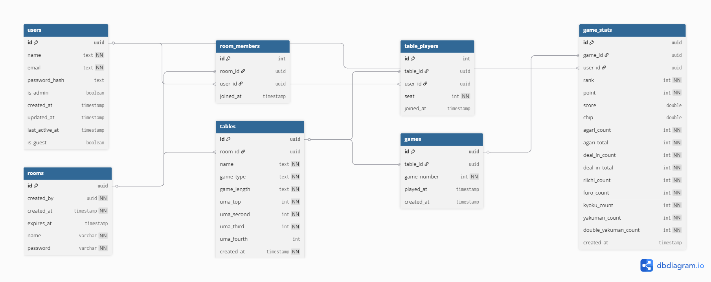

# Mahjong Portfolio

このリポジトリは、自作の麻雀戦績分析アプリのポートフォリオです。

## アプリ概要
- リアルタイムで複数人の麻雀戦績を記録・管理
- 各卓ごとの試合結果や個人の戦績分析
- 戦績データから傾向やランキングを表示

## ディレクトリ構成
- `docs/` : ワイヤーフレームや ER図
- `mahjong-app/` : Next.js + Supabase で作成したアプリ本体
- `.gitignore` : Git 管理除外ファイル
- `README.md` : このファイル

## ワイヤーフレーム

## ER図

## 技術スタック
- Next.js
- Supabase
- TypeScript
- Tailwind CSS
